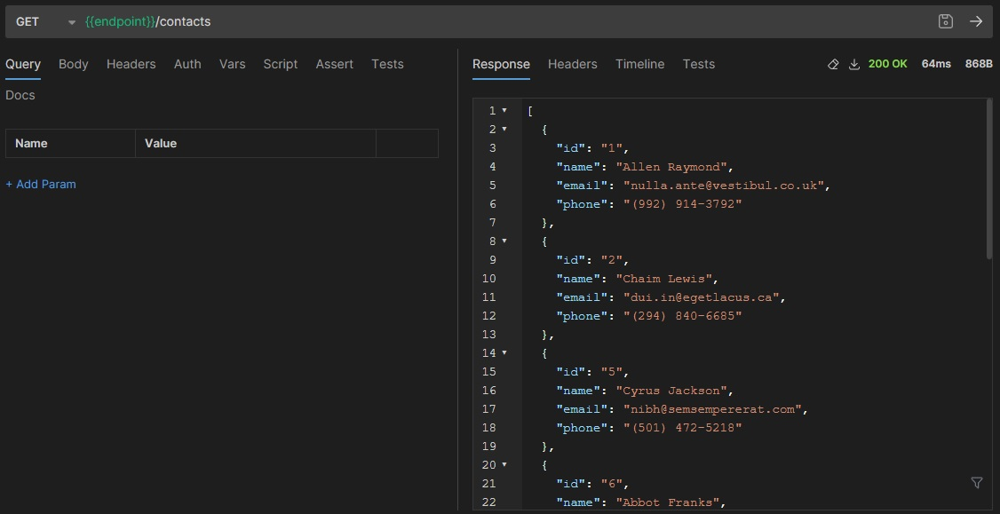
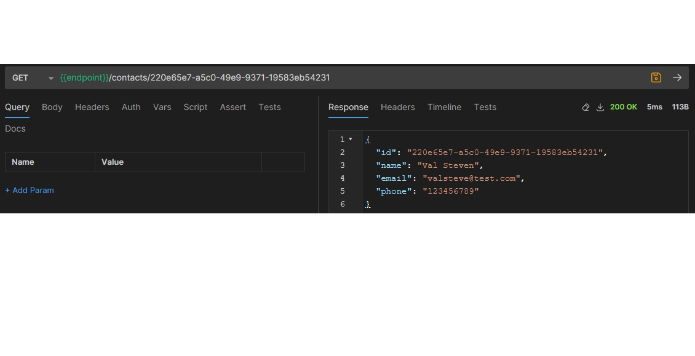
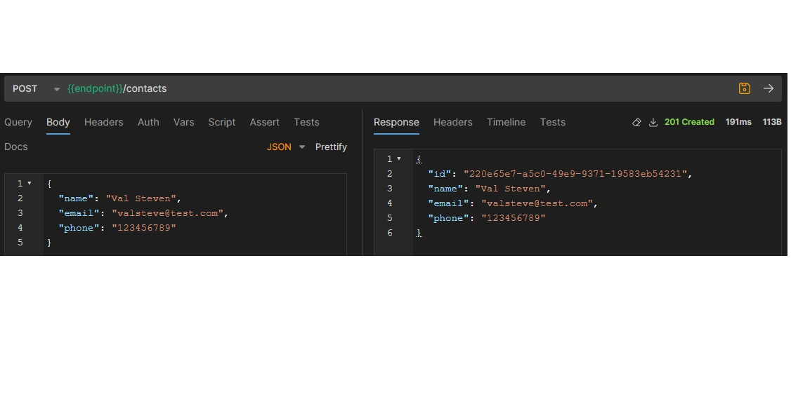
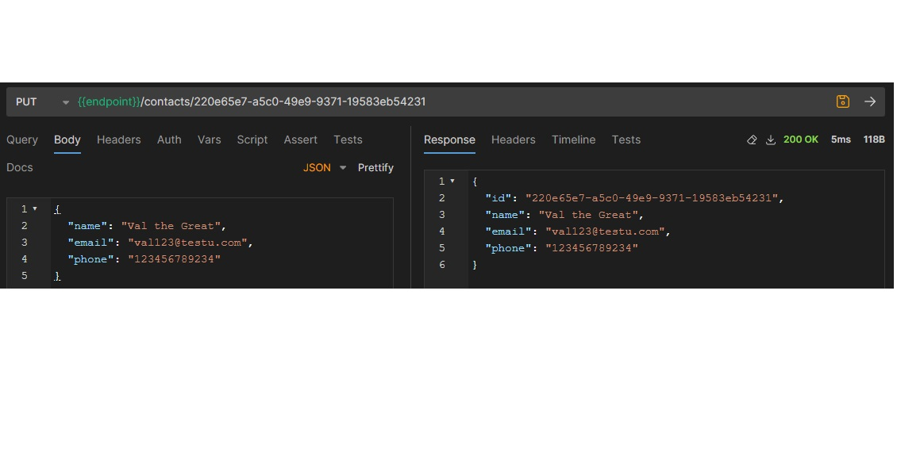
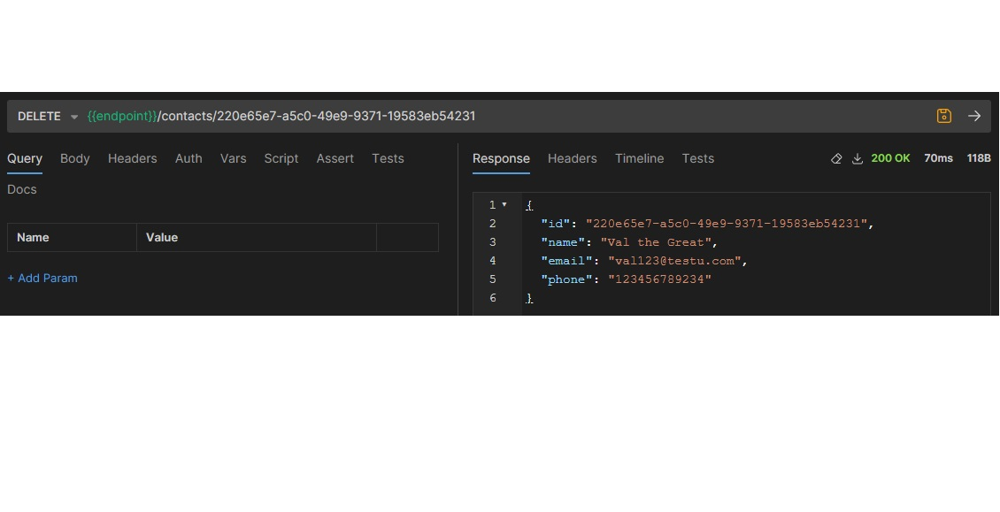

## Homework 2 - (Node.JS, Express, REST API)

### REST API for working with contacts

- Create a REST API for working with contacts.
- A contact should consist of:
  - `id`, `name`, `email`, `phone`.
- Implement the following CRUD operations:
  - Create a new contact.
  - Get all contacts.
  - Get contact by id.
  - Update contact by id.
  - Remove contact by id.
- I use [Bruno](https://www.usebruno.com/) API for testing the API.

### Screenshots

- Get list of all contacts

  - GET `/api/contacts`
  - 

- Get contact by id

  - GET `/api/contacts/:id`
  - 

- Create new contact
  - POST `/api/contacts`
  - 
- Update contact by id

  - PUT `/api/contacts/:id`
  - 

- Remove contact by id
  - DELETE `/api/contacts/:id`
  - 

## GoIT Node.js Course Template Homework

Please fork this repository to complete your homework assignments (2-6).
Forking will create a repository on your http://github.com account.

## Expalanation Recording to handle homeworks in the Node.js Block

[Watch the video](https://www.loom.com/share/007c97d271604e02ae61adbb5b69edd3)

### Commands:

- `npm start` &mdash; starts the server in production mode.
- `npm run start:dev` &mdash; starts the server in development mode.
- `npm run lint` &mdash; runs eslint to check the code. Make sure to execute this before each PR and fix all linting errors.
- `npm lint:fix` &mdash; same as the previous command but fixes simple linting errors automatically.
